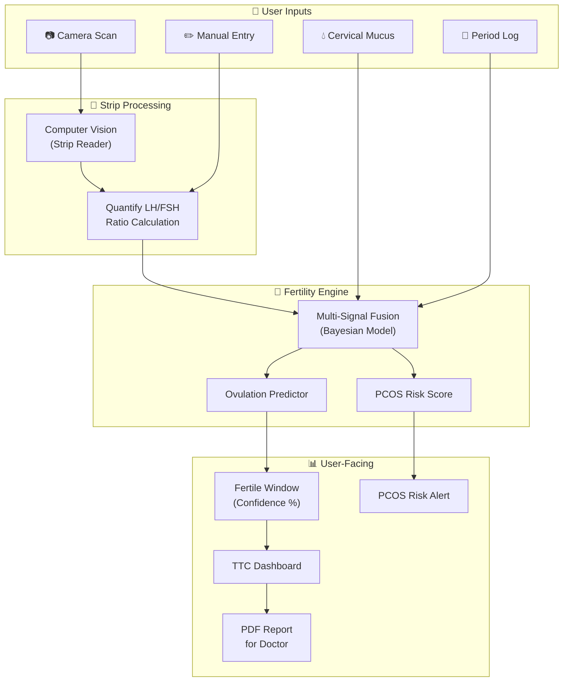

# LH/FSH Test Strip Integration & Multi-Signal Fertility Engine

## Overview

Integrate LH/FSH urine test strip scanning into Rove to deliver **the most accurate ovulation prediction and PCOS risk screening** available in an app. By fusing strip results with cervical mucus (MPIQ), period tracking, and cycle history, we build a **multi-signal fertility engine** that outperforms any single-signal tracker.

> [!IMPORTANT]
> This plan covers the full architecture end-to-end. We can phase the delivery as outlined in the rollout section.

---

## Existing Foundation (Already Built)

| Signal | Status | Where |
|--------|--------|-------|
| Period tracking | ✅ Live | `daily_logs.is_period`, `phase.ts` |
| Cycle settings | ✅ Live | `user_cycle_settings` table |
| Cervical discharge (MPIQ) | ✅ Schema exists | `daily_logs.mpiq_*` columns |
| MPIQ fertility score | ✅ Column exists | `daily_logs.mpiq_score` (1–10) |
| Fertile window calc | ✅ Live | `isInFertileWindow()` in `phase.ts` |
| Ovulation day calc | ✅ Live | `getOvulationDay()` in `phase.ts` |
| TTC tracker mode | ✅ Column exists | `user_onboarding.tracker_mode = 'ttc'` |

---

## Architecture



---

## 1. Strip Scanning Module

### 1a. Camera Capture & CV Pipeline

| Option | Pros | Cons |
|--------|------|------|
| **On-device (TensorFlow.js / ONNX)** | No server cost, instant, works offline | Larger bundle, limited accuracy |
| **Server-side (Python CV)** | Higher accuracy, easier to iterate | Latency, server cost, needs internet |
| **Hybrid** | On-device quick read + server validation | More complex |

> [!TIP]
> **Recommended: Hybrid.** On-device for instant feedback ("strip detected, processing…"), server-side for final quantified result with colour calibration.

**CV Pipeline Steps:**
1. **Strip Detection** — Detect strip outline using contour detection
2. **Colour Calibration** — Use the strip's built-in control line as a reference white/pink
3. **ROI Extraction** — Isolate the LH band and FSH band regions
4. **Intensity Quantification** — Convert band colour intensity to a 0–100 scale using LAB colour space
5. **LH/FSH Ratio Calculation** — `ratio = lh_intensity / fsh_intensity`

### 1b. Manual Entry Fallback

For users without camera access or when lighting is poor:

```
┌─────────────────────────────┐
│  LH Line Intensity          │
│  ○ No line  ○ Faint         │
│  ○ Medium   ● Dark          │
│                             │
│  FSH Line Intensity         │
│  ○ No line  ● Faint         │
│  ○ Medium   ○ Dark          │
│                             │
│  [Save Strip Result]        │
└─────────────────────────────┘
```

Mapped to numeric: No line → 0, Faint → 25, Medium → 50, Dark → 100

---

## 2. Database Schema Changes

### New Table: `strip_readings`

```sql
CREATE TABLE strip_readings (
  id uuid PRIMARY KEY DEFAULT gen_random_uuid(),
  user_id uuid REFERENCES profiles(id) ON DELETE CASCADE NOT NULL,
  date date NOT NULL,
  test_time timestamptz NOT NULL,

  -- Raw intensities (0-100 scale)
  lh_intensity numeric NOT NULL,
  fsh_intensity numeric,  -- NULL if LH-only strip

  -- Derived values
  lh_fsh_ratio numeric,   -- lh / fsh (NULL if no FSH)
  lh_surge boolean DEFAULT false,  -- True if LH ≥ surge_threshold
  
  -- Quality metadata
  input_method text CHECK (input_method IN ('camera', 'manual')),
  confidence numeric,      -- CV confidence 0-1
  image_path text,          -- S3/Supabase path to strip photo
  
  -- PCOS signals
  elevated_lh_baseline boolean DEFAULT false,  -- LH consistently > 10 mIU/mL
  
  created_at timestamptz DEFAULT now(),
  
  UNIQUE(user_id, date, test_time)
);

CREATE INDEX idx_strip_readings_user_date ON strip_readings(user_id, date DESC);
```

### Additions to `user_cycle_settings`

```sql
ALTER TABLE user_cycle_settings
ADD COLUMN IF NOT EXISTS lh_surge_threshold numeric DEFAULT 40,
ADD COLUMN IF NOT EXISTS ttc_mode_enabled boolean DEFAULT false,
ADD COLUMN IF NOT EXISTS last_confirmed_ovulation date,
ADD COLUMN IF NOT EXISTS avg_luteal_length numeric;
```

### Additions to `daily_logs`

```sql
ALTER TABLE daily_logs
ADD COLUMN IF NOT EXISTS fertility_score numeric,  -- Composite 0-100
ADD COLUMN IF NOT EXISTS ovulation_confirmed boolean DEFAULT false;
```

---

## 3. Multi-Signal Fertility Algorithm

This is the core innovation — fusing all signals into one accurate fertility prediction.

### Signal Sources & Weights

| Signal | Weight | What It Tells Us |
|--------|--------|-----------------|
| **LH strip** | 40% | Direct ovulation indicator (surge = ovulation in 24-36h) |
| **Cervical mucus (MPIQ)** | 25% | Egg-white CM = peak fertility |
| **Period cycle position** | 20% | Statistical prediction from cycle history |
| **FSH level** | 15% | Baseline follicle health + PCOS flag |

### Algorithm: `calculateFertilityScore()`

```typescript
function calculateFertilityScore(
  date: string,
  stripReading: StripReading | null,
  mpiqScore: number | null,       // 1-10 from existing MPIQ
  dayInCycle: number,
  cycleLength: number,
  lutealLength: number,
  historicalLHSurges: string[]     // Dates of past LH surges
): FertilityResult {

  let score = 0;
  let confidence: 'low' | 'medium' | 'high' = 'low';
  const signals: string[] = [];

  // ── Signal 1: LH Strip (40%) ──
  if (stripReading) {
    if (stripReading.lh_surge) {
      score += 40;  // Peak fertility
      signals.push('LH surge detected');
    } else if (stripReading.lh_intensity >= 30) {
      score += 25;  // Rising LH, approaching surge
      signals.push('LH rising');
    } else {
      score += 5;   // Low LH
    }
  }

  // ── Signal 2: Cervical Mucus (25%) ──
  if (mpiqScore !== null) {
    // MPIQ score 8-10 = egg-white/stretchy = peak fertility
    // MPIQ score 5-7  = creamy = moderate
    // MPIQ score 1-4  = dry/sticky = low
    score += (mpiqScore / 10) * 25;
    if (mpiqScore >= 8) signals.push('Peak cervical mucus');
  }

  // ── Signal 3: Cycle Position (20%) ──
  const expectedOvDay = cycleLength - lutealLength;
  const distFromOv = Math.abs(dayInCycle - expectedOvDay);
  const cyclePosScore = Math.max(0, 20 - (distFromOv * 4));
  score += cyclePosScore;

  // ── Signal 4: FSH Baseline (15%) ──
  if (stripReading?.fsh_intensity !== null && stripReading?.fsh_intensity !== undefined) {
    // Normal FSH = moderate contribution
    // Elevated FSH relative to LH = PCOS flag
    if (stripReading.fsh_intensity < 30) {
      score += 12;  // Normal FSH
    } else {
      score += 5;   // Elevated, less predictable
    }
  }

  // ── Confidence ──
  const signalCount = [
    stripReading !== null,
    mpiqScore !== null,
    true, // cycle position always available
    stripReading?.fsh_intensity !== null
  ].filter(Boolean).length;

  confidence = signalCount >= 3 ? 'high' : signalCount >= 2 ? 'medium' : 'low';

  // ── Adaptive Learning ──
  // If user has confirmed past ovulations via LH surge,
  // use average surge day to refine cycle position weight
  if (historicalLHSurges.length >= 2) {
    confidence = 'high';  // Enough data for personalised prediction
  }

  return {
    score: Math.round(Math.min(100, score)),
    confidence,
    signals,
    isOvulationDay: stripReading?.lh_surge && mpiqScore >= 8,
    recommendedAction: getAction(score),
  };
}
```

### Peak Fertility Detection Logic

```
┌──────────────────────────────────────────────────┐
│        OVULATION CONFIRMATION RULES              │
├──────────────────────────────────────────────────┤
│                                                  │
│  CONFIRMED if ANY of:                            │
│  ✓ LH surge + egg-white CM (same day ± 1)       │
│  ✓ LH surge + within ±2 days of predicted       │
│                                                  │
│  PROBABLE if:                                    │
│  ○ Egg-white CM + cycle position match           │
│  ○ LH rising (not yet surge) + CM improving      │
│                                                  │
│  PREDICTED if:                                   │
│  □ Cycle position only (calendar method)         │
│                                                  │
└──────────────────────────────────────────────────┘
```

---

## 4. PCOS Risk Screening

### PCOS Flags from Strip Data

| Flag | Threshold | Clinical Basis |
|------|-----------|---------------|
| Elevated LH:FSH ratio | LH/FSH > 2:1 on 2+ readings | Classic PCOS marker |
| Persistently high LH | LH > 10 mIU across follicular phase | Tonic LH elevation |
| No LH surge detected | 0 surges across 2+ monitored cycles | Anovulation indicator |
| Irregular cycle length | CV > 20% across 3+ cycles | Oligomenorrhea |

### `calculatePCOSRisk()`

```typescript
function calculatePCOSRisk(
  stripHistory: StripReading[],    // Last 3 months
  cycleHistory: CycleData[],       // Last 6 cycles
  symptoms: string[]                // Logged symptoms like "acne", "hair growth"
): PCOSRiskResult {

  let riskScore = 0;
  const flags: string[] = [];

  // Flag 1: LH/FSH ratio
  const ratios = stripHistory
    .filter(s => s.lh_fsh_ratio !== null)
    .map(s => s.lh_fsh_ratio);
  const highRatioCount = ratios.filter(r => r > 2).length;
  if (highRatioCount >= 2) {
    riskScore += 30;
    flags.push('Elevated LH:FSH ratio (>2:1)');
  }

  // Flag 2: No ovulation detected
  const surgeCount = stripHistory.filter(s => s.lh_surge).length;
  if (stripHistory.length >= 10 && surgeCount === 0) {
    riskScore += 25;
    flags.push('No LH surge detected');
  }

  // Flag 3: Irregular cycles
  if (cycleHistory.length >= 3) {
    const lengths = cycleHistory.map(c => c.length);
    const avg = lengths.reduce((a, b) => a + b) / lengths.length;
    const cv = Math.sqrt(
      lengths.reduce((sum, l) => sum + (l - avg) ** 2, 0) / lengths.length
    ) / avg;
    if (cv > 0.2) {
      riskScore += 20;
      flags.push('Irregular cycle lengths');
    }
  }

  // Flag 4: Supporting symptoms
  const pcosSymptoms = ['acne', 'hair growth', 'weight gain'];
  const matchingSymptoms = symptoms.filter(s => 
    pcosSymptoms.some(p => s.toLowerCase().includes(p))
  );
  riskScore += matchingSymptoms.length * 8;

  return {
    risk: riskScore >= 50 ? 'high' : riskScore >= 25 ? 'moderate' : 'low',
    score: Math.min(100, riskScore),
    flags,
    recommendation: riskScore >= 50
      ? 'Consider consulting a gynaecologist. Share your Rove report.'
      : riskScore >= 25
      ? 'Some indicators noted. Keep tracking for a clearer picture.'
      : 'No significant PCOS indicators detected.'
  };
}
```

---

## 5. TTC Dashboard UI

### Fertility Score Widget (Home Page)

```
┌───────────────────────────────────────┐
│  🎯  Today's Fertility               │
│                                       │
│      ╭──────────╮                     │
│      │          │   HIGH FERTILITY    │
│      │   82%    │   Confidence: ●●●○  │
│      │          │                     │
│      ╰──────────╯                     │
│                                       │
│  Signals:                             │
│  🧪 LH rising    💧 Peak mucus       │
│  📅 Day 13/28    ✅ 3/4 signals      │
│                                       │
│  ┌─────────────────────────────────┐  │
│  │  🔬  Scan Strip Now            │  │
│  └─────────────────────────────────┘  │
└───────────────────────────────────────┘
```

### Cycle Timeline with Multi-Signal Overlay

```
Day   5    8    11   13   14   16   20   25   28
      │    │    │    │    │    │    │    │    │
 LH   ·    ·    ·    ╱╲   │    ·    ·    ·    ·
 CM   ─    ─    ──── ████ ──── ─    ─    ─    ─
 Pos  ░░░░ ░░░░ ████ ████ ████ ░░░░ ░░░░ ░░░░ ░░░░
      │              ▲
      │        Confirmed Ovulation
```

---

## 6. Proposed File Changes

### Backend

| Action | File | Purpose |
|--------|------|---------|
| [NEW] | `backend/supabase/migrations/0XX_strip_readings.sql` | New table + index |
| [NEW] | `shared/cycle/fertility.ts` | Multi-signal algorithm |
| [MODIFY] | `shared/cycle/phase.ts` | Add `StripReading` type, adjust `isInFertileWindow` |
| [NEW] | `backend/src/actions/strip/strip-actions.ts` | Save/fetch strip readings |
| [NEW] | `backend/supabase/functions/strip-cv/index.ts` | Edge function for CV processing |
| [MODIFY] | `backend/src/actions/cycle-sync/cycle-sync.ts` | Include strip data in dashboard |

### Frontend

| Action | File | Purpose |
|--------|------|---------|
| [NEW] | `frontend/src/app/cycle-sync/scan/page.tsx` | Camera strip scanner page |
| [NEW] | `frontend/src/app/cycle-sync/scan/components/StripCamera.tsx` | Camera + CV overlay |
| [NEW] | `frontend/src/app/cycle-sync/scan/components/ManualEntry.tsx` | Fallback manual input |
| [NEW] | `frontend/src/components/cycle-sync/FertilityScoreWidget.tsx` | Home dashboard widget |
| [NEW] | `frontend/src/components/cycle-sync/PCOSRiskCard.tsx` | PCOS risk alert card |
| [MODIFY] | `frontend/src/app/cycle-sync/tracker/page.tsx` | Add strip logging to tracker |
| [MODIFY] | `frontend/src/components/cycle-sync/insights/AiAnalysisCard.tsx` | Show fertility signals |

---

## 7. Phased Rollout

### Phase 1: Foundation (2 weeks)
- [ ] DB migration for `strip_readings`
- [ ] `fertility.ts` multi-signal algorithm (works with existing MPIQ + period data)
- [ ] Manual strip entry UI
- [ ] Fertility score widget on dashboard (using period + MPIQ only initially)

### Phase 2: Camera Scanning (3 weeks)
- [ ] Strip CV pipeline (Python or ONNX)
- [ ] Camera capture UI with guide overlay  
- [ ] Server-side processing edge function
- [ ] Image storage in Supabase

### Phase 3: PCOS & Intelligence (2 weeks)
- [ ] PCOS risk screening algorithm
- [ ] PCOS alert card in Insights
- [ ] Adaptive ovulation learning (refine predictions from confirmed surges)
- [ ] PDF report generation for doctor visits

### Phase 4: TTC Dashboard (2 weeks)
- [ ] Full TTC mode toggle in profile
- [ ] Multi-signal timeline visualisation
- [ ] "Best days" notification system
- [ ] Partner sharing feature

---

## 8. Key Technical Decisions Needed

1. **LH-only vs LH+FSH strips?** — LH-only is simpler and cheaper; LH+FSH adds PCOS screening but at higher cost per strip
2. **Strip brand partnership?** — Standardising on one brand simplifies CV calibration
3. **Notification strategy** — Push notifications for "scan now" reminders during fertile window
4. **Data privacy** — Strip images stored encrypted; PCOS risk shown with clear "not a diagnosis" disclaimers
